House Prices:Advanced Regression Techniques
================

Setup
-----

### Load packages

``` r
load.libraries <- c('data.table', 'testthat', 'gridExtra', 
                    'corrplot', 'GGally', 'ggplot2', 'e1071',
                    'dplyr','glmnet','forecast','rpart','rpart.plot',
                    'randomForest','gbm')


install.lib <- load.libraries[!load.libraries %in% installed.packages()]

for(libs in install.lib) 
  install.packages(libs, dependences = TRUE)

sapply(load.libraries, require, character = TRUE)
```

    ## Loading required package: data.table

    ## Loading required package: testthat

    ## Loading required package: gridExtra

    ## Loading required package: corrplot

    ## Loading required package: GGally

    ## Loading required package: ggplot2

    ## Loading required package: e1071

    ## Loading required package: dplyr

    ## 
    ## Attaching package: 'dplyr'

    ## The following object is masked from 'package:GGally':
    ## 
    ##     nasa

    ## The following object is masked from 'package:gridExtra':
    ## 
    ##     combine

    ## The following object is masked from 'package:testthat':
    ## 
    ##     matches

    ## The following objects are masked from 'package:data.table':
    ## 
    ##     between, first, last

    ## The following objects are masked from 'package:stats':
    ## 
    ##     filter, lag

    ## The following objects are masked from 'package:base':
    ## 
    ##     intersect, setdiff, setequal, union

    ## Loading required package: glmnet

    ## Loading required package: Matrix

    ## Loading required package: foreach

    ## Loaded glmnet 2.0-10

    ## Loading required package: forecast

    ## Loading required package: rpart

    ## Loading required package: rpart.plot

    ## Loading required package: randomForest

    ## randomForest 4.6-12

    ## Type rfNews() to see new features/changes/bug fixes.

    ## 
    ## Attaching package: 'randomForest'

    ## The following object is masked from 'package:dplyr':
    ## 
    ##     combine

    ## The following object is masked from 'package:ggplot2':
    ## 
    ##     margin

    ## The following object is masked from 'package:gridExtra':
    ## 
    ##     combine

    ## Loading required package: gbm

    ## Loading required package: survival

    ## Loading required package: lattice

    ## Loading required package: splines

    ## Loading required package: parallel

    ## Loaded gbm 2.1.3

    ##   data.table     testthat    gridExtra     corrplot       GGally 
    ##         TRUE         TRUE         TRUE         TRUE         TRUE 
    ##      ggplot2        e1071        dplyr       glmnet     forecast 
    ##         TRUE         TRUE         TRUE         TRUE         TRUE 
    ##        rpart   rpart.plot randomForest          gbm 
    ##         TRUE         TRUE         TRUE         TRUE

### Load data

``` r
train <- read.csv("train.csv",stringsAsFactors = F)
```

------------------------------------------------------------------------

Part 1: Data
------------

This dataset contains 1460 observations and 79 explanatory variables describing (almost) every aspect of residential homes in Ames, Iowa. The goal of this project is to predict the final price of each home.

------------------------------------------------------------------------

Part 2: Exploratory Data Analysis (EDA)
---------------------------------------

Let's take a close look at the structure of the data.

``` r
dim(train)
```

    ## [1] 1460   81

``` r
str(train)
```

    ## 'data.frame':    1460 obs. of  81 variables:
    ##  $ Id           : int  1 2 3 4 5 6 7 8 9 10 ...
    ##  $ MSSubClass   : int  60 20 60 70 60 50 20 60 50 190 ...
    ##  $ MSZoning     : chr  "RL" "RL" "RL" "RL" ...
    ##  $ LotFrontage  : int  65 80 68 60 84 85 75 NA 51 50 ...
    ##  $ LotArea      : int  8450 9600 11250 9550 14260 14115 10084 10382 6120 7420 ...
    ##  $ Street       : chr  "Pave" "Pave" "Pave" "Pave" ...
    ##  $ Alley        : chr  NA NA NA NA ...
    ##  $ LotShape     : chr  "Reg" "Reg" "IR1" "IR1" ...
    ##  $ LandContour  : chr  "Lvl" "Lvl" "Lvl" "Lvl" ...
    ##  $ Utilities    : chr  "AllPub" "AllPub" "AllPub" "AllPub" ...
    ##  $ LotConfig    : chr  "Inside" "FR2" "Inside" "Corner" ...
    ##  $ LandSlope    : chr  "Gtl" "Gtl" "Gtl" "Gtl" ...
    ##  $ Neighborhood : chr  "CollgCr" "Veenker" "CollgCr" "Crawfor" ...
    ##  $ Condition1   : chr  "Norm" "Feedr" "Norm" "Norm" ...
    ##  $ Condition2   : chr  "Norm" "Norm" "Norm" "Norm" ...
    ##  $ BldgType     : chr  "1Fam" "1Fam" "1Fam" "1Fam" ...
    ##  $ HouseStyle   : chr  "2Story" "1Story" "2Story" "2Story" ...
    ##  $ OverallQual  : int  7 6 7 7 8 5 8 7 7 5 ...
    ##  $ OverallCond  : int  5 8 5 5 5 5 5 6 5 6 ...
    ##  $ YearBuilt    : int  2003 1976 2001 1915 2000 1993 2004 1973 1931 1939 ...
    ##  $ YearRemodAdd : int  2003 1976 2002 1970 2000 1995 2005 1973 1950 1950 ...
    ##  $ RoofStyle    : chr  "Gable" "Gable" "Gable" "Gable" ...
    ##  $ RoofMatl     : chr  "CompShg" "CompShg" "CompShg" "CompShg" ...
    ##  $ Exterior1st  : chr  "VinylSd" "MetalSd" "VinylSd" "Wd Sdng" ...
    ##  $ Exterior2nd  : chr  "VinylSd" "MetalSd" "VinylSd" "Wd Shng" ...
    ##  $ MasVnrType   : chr  "BrkFace" "None" "BrkFace" "None" ...
    ##  $ MasVnrArea   : int  196 0 162 0 350 0 186 240 0 0 ...
    ##  $ ExterQual    : chr  "Gd" "TA" "Gd" "TA" ...
    ##  $ ExterCond    : chr  "TA" "TA" "TA" "TA" ...
    ##  $ Foundation   : chr  "PConc" "CBlock" "PConc" "BrkTil" ...
    ##  $ BsmtQual     : chr  "Gd" "Gd" "Gd" "TA" ...
    ##  $ BsmtCond     : chr  "TA" "TA" "TA" "Gd" ...
    ##  $ BsmtExposure : chr  "No" "Gd" "Mn" "No" ...
    ##  $ BsmtFinType1 : chr  "GLQ" "ALQ" "GLQ" "ALQ" ...
    ##  $ BsmtFinSF1   : int  706 978 486 216 655 732 1369 859 0 851 ...
    ##  $ BsmtFinType2 : chr  "Unf" "Unf" "Unf" "Unf" ...
    ##  $ BsmtFinSF2   : int  0 0 0 0 0 0 0 32 0 0 ...
    ##  $ BsmtUnfSF    : int  150 284 434 540 490 64 317 216 952 140 ...
    ##  $ TotalBsmtSF  : int  856 1262 920 756 1145 796 1686 1107 952 991 ...
    ##  $ Heating      : chr  "GasA" "GasA" "GasA" "GasA" ...
    ##  $ HeatingQC    : chr  "Ex" "Ex" "Ex" "Gd" ...
    ##  $ CentralAir   : chr  "Y" "Y" "Y" "Y" ...
    ##  $ Electrical   : chr  "SBrkr" "SBrkr" "SBrkr" "SBrkr" ...
    ##  $ X1stFlrSF    : int  856 1262 920 961 1145 796 1694 1107 1022 1077 ...
    ##  $ X2ndFlrSF    : int  854 0 866 756 1053 566 0 983 752 0 ...
    ##  $ LowQualFinSF : int  0 0 0 0 0 0 0 0 0 0 ...
    ##  $ GrLivArea    : int  1710 1262 1786 1717 2198 1362 1694 2090 1774 1077 ...
    ##  $ BsmtFullBath : int  1 0 1 1 1 1 1 1 0 1 ...
    ##  $ BsmtHalfBath : int  0 1 0 0 0 0 0 0 0 0 ...
    ##  $ FullBath     : int  2 2 2 1 2 1 2 2 2 1 ...
    ##  $ HalfBath     : int  1 0 1 0 1 1 0 1 0 0 ...
    ##  $ BedroomAbvGr : int  3 3 3 3 4 1 3 3 2 2 ...
    ##  $ KitchenAbvGr : int  1 1 1 1 1 1 1 1 2 2 ...
    ##  $ KitchenQual  : chr  "Gd" "TA" "Gd" "Gd" ...
    ##  $ TotRmsAbvGrd : int  8 6 6 7 9 5 7 7 8 5 ...
    ##  $ Functional   : chr  "Typ" "Typ" "Typ" "Typ" ...
    ##  $ Fireplaces   : int  0 1 1 1 1 0 1 2 2 2 ...
    ##  $ FireplaceQu  : chr  NA "TA" "TA" "Gd" ...
    ##  $ GarageType   : chr  "Attchd" "Attchd" "Attchd" "Detchd" ...
    ##  $ GarageYrBlt  : int  2003 1976 2001 1998 2000 1993 2004 1973 1931 1939 ...
    ##  $ GarageFinish : chr  "RFn" "RFn" "RFn" "Unf" ...
    ##  $ GarageCars   : int  2 2 2 3 3 2 2 2 2 1 ...
    ##  $ GarageArea   : int  548 460 608 642 836 480 636 484 468 205 ...
    ##  $ GarageQual   : chr  "TA" "TA" "TA" "TA" ...
    ##  $ GarageCond   : chr  "TA" "TA" "TA" "TA" ...
    ##  $ PavedDrive   : chr  "Y" "Y" "Y" "Y" ...
    ##  $ WoodDeckSF   : int  0 298 0 0 192 40 255 235 90 0 ...
    ##  $ OpenPorchSF  : int  61 0 42 35 84 30 57 204 0 4 ...
    ##  $ EnclosedPorch: int  0 0 0 272 0 0 0 228 205 0 ...
    ##  $ X3SsnPorch   : int  0 0 0 0 0 320 0 0 0 0 ...
    ##  $ ScreenPorch  : int  0 0 0 0 0 0 0 0 0 0 ...
    ##  $ PoolArea     : int  0 0 0 0 0 0 0 0 0 0 ...
    ##  $ PoolQC       : chr  NA NA NA NA ...
    ##  $ Fence        : chr  NA NA NA NA ...
    ##  $ MiscFeature  : chr  NA NA NA NA ...
    ##  $ MiscVal      : int  0 0 0 0 0 700 0 350 0 0 ...
    ##  $ MoSold       : int  2 5 9 2 12 10 8 11 4 1 ...
    ##  $ YrSold       : int  2008 2007 2008 2006 2008 2009 2007 2009 2008 2008 ...
    ##  $ SaleType     : chr  "WD" "WD" "WD" "WD" ...
    ##  $ SaleCondition: chr  "Normal" "Normal" "Normal" "Abnorml" ...
    ##  $ SalePrice    : int  208500 181500 223500 140000 250000 143000 307000 200000 129900 118000 ...

To better process the data, we divide the data into categorical and numerical variables.

``` r
cat_var <- names(train)[which(sapply(train, is.character))]

cat_var <- c(cat_var, 'BedroomAbvGr', 'HalfBath', 
             'KitchenAbvGr','BsmtFullBath', 'BsmtHalfBath', 
             'MSSubClass')

numeric_var <- names(train)[which(sapply(train,is.numeric))]
```

### Missing values

From the first five rows of the data, we can observate that there are some missing data.

``` r
head(train)
```

    ##   Id MSSubClass MSZoning LotFrontage LotArea Street Alley LotShape
    ## 1  1         60       RL          65    8450   Pave  <NA>      Reg
    ## 2  2         20       RL          80    9600   Pave  <NA>      Reg
    ## 3  3         60       RL          68   11250   Pave  <NA>      IR1
    ## 4  4         70       RL          60    9550   Pave  <NA>      IR1
    ## 5  5         60       RL          84   14260   Pave  <NA>      IR1
    ## 6  6         50       RL          85   14115   Pave  <NA>      IR1
    ##   LandContour Utilities LotConfig LandSlope Neighborhood Condition1
    ## 1         Lvl    AllPub    Inside       Gtl      CollgCr       Norm
    ## 2         Lvl    AllPub       FR2       Gtl      Veenker      Feedr
    ## 3         Lvl    AllPub    Inside       Gtl      CollgCr       Norm
    ## 4         Lvl    AllPub    Corner       Gtl      Crawfor       Norm
    ## 5         Lvl    AllPub       FR2       Gtl      NoRidge       Norm
    ## 6         Lvl    AllPub    Inside       Gtl      Mitchel       Norm
    ##   Condition2 BldgType HouseStyle OverallQual OverallCond YearBuilt
    ## 1       Norm     1Fam     2Story           7           5      2003
    ## 2       Norm     1Fam     1Story           6           8      1976
    ## 3       Norm     1Fam     2Story           7           5      2001
    ## 4       Norm     1Fam     2Story           7           5      1915
    ## 5       Norm     1Fam     2Story           8           5      2000
    ## 6       Norm     1Fam     1.5Fin           5           5      1993
    ##   YearRemodAdd RoofStyle RoofMatl Exterior1st Exterior2nd MasVnrType
    ## 1         2003     Gable  CompShg     VinylSd     VinylSd    BrkFace
    ## 2         1976     Gable  CompShg     MetalSd     MetalSd       None
    ## 3         2002     Gable  CompShg     VinylSd     VinylSd    BrkFace
    ## 4         1970     Gable  CompShg     Wd Sdng     Wd Shng       None
    ## 5         2000     Gable  CompShg     VinylSd     VinylSd    BrkFace
    ## 6         1995     Gable  CompShg     VinylSd     VinylSd       None
    ##   MasVnrArea ExterQual ExterCond Foundation BsmtQual BsmtCond BsmtExposure
    ## 1        196        Gd        TA      PConc       Gd       TA           No
    ## 2          0        TA        TA     CBlock       Gd       TA           Gd
    ## 3        162        Gd        TA      PConc       Gd       TA           Mn
    ## 4          0        TA        TA     BrkTil       TA       Gd           No
    ## 5        350        Gd        TA      PConc       Gd       TA           Av
    ## 6          0        TA        TA       Wood       Gd       TA           No
    ##   BsmtFinType1 BsmtFinSF1 BsmtFinType2 BsmtFinSF2 BsmtUnfSF TotalBsmtSF
    ## 1          GLQ        706          Unf          0       150         856
    ## 2          ALQ        978          Unf          0       284        1262
    ## 3          GLQ        486          Unf          0       434         920
    ## 4          ALQ        216          Unf          0       540         756
    ## 5          GLQ        655          Unf          0       490        1145
    ## 6          GLQ        732          Unf          0        64         796
    ##   Heating HeatingQC CentralAir Electrical X1stFlrSF X2ndFlrSF LowQualFinSF
    ## 1    GasA        Ex          Y      SBrkr       856       854            0
    ## 2    GasA        Ex          Y      SBrkr      1262         0            0
    ## 3    GasA        Ex          Y      SBrkr       920       866            0
    ## 4    GasA        Gd          Y      SBrkr       961       756            0
    ## 5    GasA        Ex          Y      SBrkr      1145      1053            0
    ## 6    GasA        Ex          Y      SBrkr       796       566            0
    ##   GrLivArea BsmtFullBath BsmtHalfBath FullBath HalfBath BedroomAbvGr
    ## 1      1710            1            0        2        1            3
    ## 2      1262            0            1        2        0            3
    ## 3      1786            1            0        2        1            3
    ## 4      1717            1            0        1        0            3
    ## 5      2198            1            0        2        1            4
    ## 6      1362            1            0        1        1            1
    ##   KitchenAbvGr KitchenQual TotRmsAbvGrd Functional Fireplaces FireplaceQu
    ## 1            1          Gd            8        Typ          0        <NA>
    ## 2            1          TA            6        Typ          1          TA
    ## 3            1          Gd            6        Typ          1          TA
    ## 4            1          Gd            7        Typ          1          Gd
    ## 5            1          Gd            9        Typ          1          TA
    ## 6            1          TA            5        Typ          0        <NA>
    ##   GarageType GarageYrBlt GarageFinish GarageCars GarageArea GarageQual
    ## 1     Attchd        2003          RFn          2        548         TA
    ## 2     Attchd        1976          RFn          2        460         TA
    ## 3     Attchd        2001          RFn          2        608         TA
    ## 4     Detchd        1998          Unf          3        642         TA
    ## 5     Attchd        2000          RFn          3        836         TA
    ## 6     Attchd        1993          Unf          2        480         TA
    ##   GarageCond PavedDrive WoodDeckSF OpenPorchSF EnclosedPorch X3SsnPorch
    ## 1         TA          Y          0          61             0          0
    ## 2         TA          Y        298           0             0          0
    ## 3         TA          Y          0          42             0          0
    ## 4         TA          Y          0          35           272          0
    ## 5         TA          Y        192          84             0          0
    ## 6         TA          Y         40          30             0        320
    ##   ScreenPorch PoolArea PoolQC Fence MiscFeature MiscVal MoSold YrSold
    ## 1           0        0   <NA>  <NA>        <NA>       0      2   2008
    ## 2           0        0   <NA>  <NA>        <NA>       0      5   2007
    ## 3           0        0   <NA>  <NA>        <NA>       0      9   2008
    ## 4           0        0   <NA>  <NA>        <NA>       0      2   2006
    ## 5           0        0   <NA>  <NA>        <NA>       0     12   2008
    ## 6           0        0   <NA> MnPrv        Shed     700     10   2009
    ##   SaleType SaleCondition SalePrice
    ## 1       WD        Normal    208500
    ## 2       WD        Normal    181500
    ## 3       WD        Normal    223500
    ## 4       WD       Abnorml    140000
    ## 5       WD        Normal    250000
    ## 6       WD        Normal    143000

The summary of the total missing values of each variable is as follow:

``` r
colSums(sapply(train, is.na))
```

    ##            Id    MSSubClass      MSZoning   LotFrontage       LotArea 
    ##             0             0             0           259             0 
    ##        Street         Alley      LotShape   LandContour     Utilities 
    ##             0          1369             0             0             0 
    ##     LotConfig     LandSlope  Neighborhood    Condition1    Condition2 
    ##             0             0             0             0             0 
    ##      BldgType    HouseStyle   OverallQual   OverallCond     YearBuilt 
    ##             0             0             0             0             0 
    ##  YearRemodAdd     RoofStyle      RoofMatl   Exterior1st   Exterior2nd 
    ##             0             0             0             0             0 
    ##    MasVnrType    MasVnrArea     ExterQual     ExterCond    Foundation 
    ##             8             8             0             0             0 
    ##      BsmtQual      BsmtCond  BsmtExposure  BsmtFinType1    BsmtFinSF1 
    ##            37            37            38            37             0 
    ##  BsmtFinType2    BsmtFinSF2     BsmtUnfSF   TotalBsmtSF       Heating 
    ##            38             0             0             0             0 
    ##     HeatingQC    CentralAir    Electrical     X1stFlrSF     X2ndFlrSF 
    ##             0             0             1             0             0 
    ##  LowQualFinSF     GrLivArea  BsmtFullBath  BsmtHalfBath      FullBath 
    ##             0             0             0             0             0 
    ##      HalfBath  BedroomAbvGr  KitchenAbvGr   KitchenQual  TotRmsAbvGrd 
    ##             0             0             0             0             0 
    ##    Functional    Fireplaces   FireplaceQu    GarageType   GarageYrBlt 
    ##             0             0           690            81            81 
    ##  GarageFinish    GarageCars    GarageArea    GarageQual    GarageCond 
    ##            81             0             0            81            81 
    ##    PavedDrive    WoodDeckSF   OpenPorchSF EnclosedPorch    X3SsnPorch 
    ##             0             0             0             0             0 
    ##   ScreenPorch      PoolArea        PoolQC         Fence   MiscFeature 
    ##             0             0          1453          1179          1406 
    ##       MiscVal        MoSold        YrSold      SaleType SaleCondition 
    ##             0             0             0             0             0 
    ##     SalePrice 
    ##             0

The number of missing values for categorical variables

``` r
setDT(train)
colSums(sapply(train[,.SD, .SDcols = cat_var], is.na))
```

    ##      MSZoning        Street         Alley      LotShape   LandContour 
    ##             0             0          1369             0             0 
    ##     Utilities     LotConfig     LandSlope  Neighborhood    Condition1 
    ##             0             0             0             0             0 
    ##    Condition2      BldgType    HouseStyle     RoofStyle      RoofMatl 
    ##             0             0             0             0             0 
    ##   Exterior1st   Exterior2nd    MasVnrType     ExterQual     ExterCond 
    ##             0             0             8             0             0 
    ##    Foundation      BsmtQual      BsmtCond  BsmtExposure  BsmtFinType1 
    ##             0            37            37            38            37 
    ##  BsmtFinType2       Heating     HeatingQC    CentralAir    Electrical 
    ##            38             0             0             0             1 
    ##   KitchenQual    Functional   FireplaceQu    GarageType  GarageFinish 
    ##             0             0           690            81            81 
    ##    GarageQual    GarageCond    PavedDrive        PoolQC         Fence 
    ##            81            81             0          1453          1179 
    ##   MiscFeature      SaleType SaleCondition  BedroomAbvGr      HalfBath 
    ##          1406             0             0             0             0 
    ##  KitchenAbvGr  BsmtFullBath  BsmtHalfBath    MSSubClass 
    ##             0             0             0             0

The number of missing values for numercial variables

``` r
colSums(sapply(train[, .SD, .SDcols = numeric_var], is.na))
```

    ##            Id    MSSubClass   LotFrontage       LotArea   OverallQual 
    ##             0             0           259             0             0 
    ##   OverallCond     YearBuilt  YearRemodAdd    MasVnrArea    BsmtFinSF1 
    ##             0             0             0             8             0 
    ##    BsmtFinSF2     BsmtUnfSF   TotalBsmtSF     X1stFlrSF     X2ndFlrSF 
    ##             0             0             0             0             0 
    ##  LowQualFinSF     GrLivArea  BsmtFullBath  BsmtHalfBath      FullBath 
    ##             0             0             0             0             0 
    ##      HalfBath  BedroomAbvGr  KitchenAbvGr  TotRmsAbvGrd    Fireplaces 
    ##             0             0             0             0             0 
    ##   GarageYrBlt    GarageCars    GarageArea    WoodDeckSF   OpenPorchSF 
    ##            81             0             0             0             0 
    ## EnclosedPorch    X3SsnPorch   ScreenPorch      PoolArea       MiscVal 
    ##             0             0             0             0             0 
    ##        MoSold        YrSold     SalePrice 
    ##             0             0             0

Visualization for the missing data

``` r
plot_Missing <- function(data_in, title = NULL) {
  temp_df <- as.data.frame(ifelse(is.na(data_in), 0, 1))
  temp_df <- temp_df[, order(colSums(temp_df))]
  data_temp <- expand.grid(list(x = 1:nrow(temp_df), y = colnames(temp_df)))
  data_temp$m <- as.vector(as.matrix(temp_df))
  data_temp <- data.frame(x = unlist(data_temp$x), y = unlist(data_temp$y), m = unlist(data_temp$m))
  ggplot(data_temp) + geom_tile(aes(x=x, y=y, fill=factor(m))) + scale_fill_manual(values=c("white", "black"), name="Missing\n(0=Yes, 1=No)") + theme_light() + ylab("") + xlab("") + ggtitle(title)
}

  
plot_Missing(train[,colSums(is.na(train)) > 0, with = F])
```

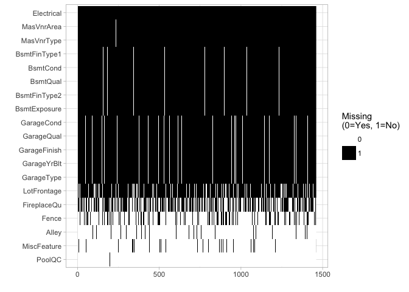

### Summary Statistics for numercial data

``` r
setDT(train)
summary(train[, .SD, .SDcols = numeric_var])
```

    ##        Id           MSSubClass     LotFrontage        LotArea      
    ##  Min.   :   1.0   Min.   : 20.0   Min.   : 21.00   Min.   :  1300  
    ##  1st Qu.: 365.8   1st Qu.: 20.0   1st Qu.: 59.00   1st Qu.:  7554  
    ##  Median : 730.5   Median : 50.0   Median : 69.00   Median :  9478  
    ##  Mean   : 730.5   Mean   : 56.9   Mean   : 70.05   Mean   : 10517  
    ##  3rd Qu.:1095.2   3rd Qu.: 70.0   3rd Qu.: 80.00   3rd Qu.: 11602  
    ##  Max.   :1460.0   Max.   :190.0   Max.   :313.00   Max.   :215245  
    ##                                   NA's   :259                      
    ##   OverallQual      OverallCond      YearBuilt     YearRemodAdd 
    ##  Min.   : 1.000   Min.   :1.000   Min.   :1872   Min.   :1950  
    ##  1st Qu.: 5.000   1st Qu.:5.000   1st Qu.:1954   1st Qu.:1967  
    ##  Median : 6.000   Median :5.000   Median :1973   Median :1994  
    ##  Mean   : 6.099   Mean   :5.575   Mean   :1971   Mean   :1985  
    ##  3rd Qu.: 7.000   3rd Qu.:6.000   3rd Qu.:2000   3rd Qu.:2004  
    ##  Max.   :10.000   Max.   :9.000   Max.   :2010   Max.   :2010  
    ##                                                                
    ##    MasVnrArea       BsmtFinSF1       BsmtFinSF2        BsmtUnfSF     
    ##  Min.   :   0.0   Min.   :   0.0   Min.   :   0.00   Min.   :   0.0  
    ##  1st Qu.:   0.0   1st Qu.:   0.0   1st Qu.:   0.00   1st Qu.: 223.0  
    ##  Median :   0.0   Median : 383.5   Median :   0.00   Median : 477.5  
    ##  Mean   : 103.7   Mean   : 443.6   Mean   :  46.55   Mean   : 567.2  
    ##  3rd Qu.: 166.0   3rd Qu.: 712.2   3rd Qu.:   0.00   3rd Qu.: 808.0  
    ##  Max.   :1600.0   Max.   :5644.0   Max.   :1474.00   Max.   :2336.0  
    ##  NA's   :8                                                           
    ##   TotalBsmtSF       X1stFlrSF      X2ndFlrSF     LowQualFinSF    
    ##  Min.   :   0.0   Min.   : 334   Min.   :   0   Min.   :  0.000  
    ##  1st Qu.: 795.8   1st Qu.: 882   1st Qu.:   0   1st Qu.:  0.000  
    ##  Median : 991.5   Median :1087   Median :   0   Median :  0.000  
    ##  Mean   :1057.4   Mean   :1163   Mean   : 347   Mean   :  5.845  
    ##  3rd Qu.:1298.2   3rd Qu.:1391   3rd Qu.: 728   3rd Qu.:  0.000  
    ##  Max.   :6110.0   Max.   :4692   Max.   :2065   Max.   :572.000  
    ##                                                                  
    ##    GrLivArea     BsmtFullBath     BsmtHalfBath        FullBath    
    ##  Min.   : 334   Min.   :0.0000   Min.   :0.00000   Min.   :0.000  
    ##  1st Qu.:1130   1st Qu.:0.0000   1st Qu.:0.00000   1st Qu.:1.000  
    ##  Median :1464   Median :0.0000   Median :0.00000   Median :2.000  
    ##  Mean   :1515   Mean   :0.4253   Mean   :0.05753   Mean   :1.565  
    ##  3rd Qu.:1777   3rd Qu.:1.0000   3rd Qu.:0.00000   3rd Qu.:2.000  
    ##  Max.   :5642   Max.   :3.0000   Max.   :2.00000   Max.   :3.000  
    ##                                                                   
    ##     HalfBath       BedroomAbvGr    KitchenAbvGr    TotRmsAbvGrd   
    ##  Min.   :0.0000   Min.   :0.000   Min.   :0.000   Min.   : 2.000  
    ##  1st Qu.:0.0000   1st Qu.:2.000   1st Qu.:1.000   1st Qu.: 5.000  
    ##  Median :0.0000   Median :3.000   Median :1.000   Median : 6.000  
    ##  Mean   :0.3829   Mean   :2.866   Mean   :1.047   Mean   : 6.518  
    ##  3rd Qu.:1.0000   3rd Qu.:3.000   3rd Qu.:1.000   3rd Qu.: 7.000  
    ##  Max.   :2.0000   Max.   :8.000   Max.   :3.000   Max.   :14.000  
    ##                                                                   
    ##    Fireplaces     GarageYrBlt     GarageCars      GarageArea    
    ##  Min.   :0.000   Min.   :1900   Min.   :0.000   Min.   :   0.0  
    ##  1st Qu.:0.000   1st Qu.:1961   1st Qu.:1.000   1st Qu.: 334.5  
    ##  Median :1.000   Median :1980   Median :2.000   Median : 480.0  
    ##  Mean   :0.613   Mean   :1979   Mean   :1.767   Mean   : 473.0  
    ##  3rd Qu.:1.000   3rd Qu.:2002   3rd Qu.:2.000   3rd Qu.: 576.0  
    ##  Max.   :3.000   Max.   :2010   Max.   :4.000   Max.   :1418.0  
    ##                  NA's   :81                                     
    ##    WoodDeckSF      OpenPorchSF     EnclosedPorch      X3SsnPorch    
    ##  Min.   :  0.00   Min.   :  0.00   Min.   :  0.00   Min.   :  0.00  
    ##  1st Qu.:  0.00   1st Qu.:  0.00   1st Qu.:  0.00   1st Qu.:  0.00  
    ##  Median :  0.00   Median : 25.00   Median :  0.00   Median :  0.00  
    ##  Mean   : 94.24   Mean   : 46.66   Mean   : 21.95   Mean   :  3.41  
    ##  3rd Qu.:168.00   3rd Qu.: 68.00   3rd Qu.:  0.00   3rd Qu.:  0.00  
    ##  Max.   :857.00   Max.   :547.00   Max.   :552.00   Max.   :508.00  
    ##                                                                     
    ##   ScreenPorch        PoolArea          MiscVal             MoSold      
    ##  Min.   :  0.00   Min.   :  0.000   Min.   :    0.00   Min.   : 1.000  
    ##  1st Qu.:  0.00   1st Qu.:  0.000   1st Qu.:    0.00   1st Qu.: 5.000  
    ##  Median :  0.00   Median :  0.000   Median :    0.00   Median : 6.000  
    ##  Mean   : 15.06   Mean   :  2.759   Mean   :   43.49   Mean   : 6.322  
    ##  3rd Qu.:  0.00   3rd Qu.:  0.000   3rd Qu.:    0.00   3rd Qu.: 8.000  
    ##  Max.   :480.00   Max.   :738.000   Max.   :15500.00   Max.   :12.000  
    ##                                                                        
    ##      YrSold       SalePrice     
    ##  Min.   :2006   Min.   : 34900  
    ##  1st Qu.:2007   1st Qu.:129975  
    ##  Median :2008   Median :163000  
    ##  Mean   :2008   Mean   :180921  
    ##  3rd Qu.:2009   3rd Qu.:214000  
    ##  Max.   :2010   Max.   :755000  
    ## 

### Remodeled houses

To see the number of houses that were remodeled, we can compare `YearBuilt` (Original construction date) and `YearRmodAdd` (Remodel date). If they are different, the house was remodeled. The result indicate that 696 houses were remodeled.

``` r
sum(train$YearBuilt != train$YearRemodAdd)
```

    ## [1] 696

``` r
cat("Percentage of houses remodeled :", sum(train$YearBuilt != train$YearRemodAdd)/dim(train)[1])
```

    ## Percentage of houses remodeled : 0.4767123

``` r
remodeled <- train %>%
  mutate(Remodeled = ifelse(train$YearBuilt != train$YearRemodAdd, "Yes", "No"))

ggplot(data = remodeled, aes(x = Remodeled)) + geom_bar()
```

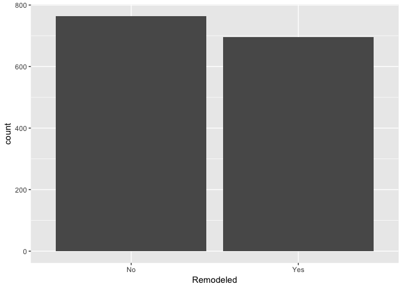

### Check for duplicated rows

``` r
cat("The number of duplicated rows are", nrow(train) - nrow(unique(train)))
```

    ## The number of duplicated rows are 0

### Barplots for the categorical features

``` r
setDT(train)
train_cat <- train[,.SD, .SDcols = cat_var]
train_cont <- train[,.SD,.SDcols = numeric_var]

plotHist <- function(data_in, i) {
  data <- data.frame(x=data_in[[i]])
  p <- ggplot(data=data, aes(x=factor(x))) + stat_count() + xlab(colnames(data_in)[i]) + theme_light() + theme(axis.text.x = element_text(angle = 90, hjust =1))
  return (p)
}

doPlots <- function(data_in, fun, ii, ncol=2) {
  pp <- list()
  for (i in ii) {
    p <- fun(data_in=data_in, i=i)
    pp <- c(pp, list(p))
  }
  do.call("grid.arrange", c(pp, ncol=ncol))
}

#grid.arrange(p1,p2,p3,p4)

plotDen <- function(data_in, i){
  data <- data.frame(x=data_in[[i]], SalePrice = data_in$SalePrice)
  p <- ggplot(data= data) + geom_line(aes(x = x), stat = 'density', size = 1,alpha = 1.0) +
    xlab(paste0((colnames(data_in)[i]), '\n', 'Skewness: ',round(skewness(data_in[[i]], na.rm = TRUE), 2))) + theme_light() 
  return(p)
   
}
```

``` r
doPlots(train_cat, fun = plotHist, ii=1:4, ncol = 2)
```

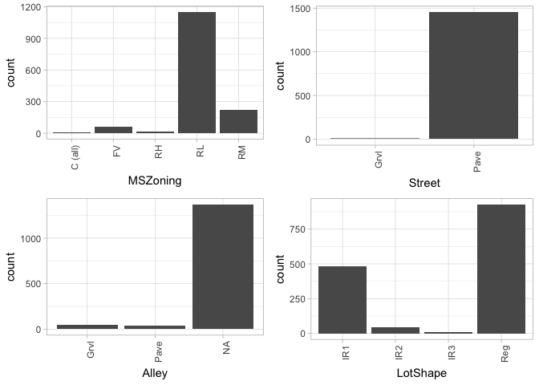

``` r
doPlots(train_cat, fun = plotHist, ii  = 4:8, ncol = 2)
```

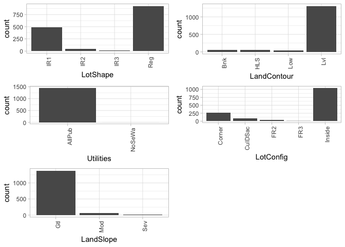

``` r
doPlots(train_cat, fun = plotHist, ii = 8:12, ncol = 2)
```

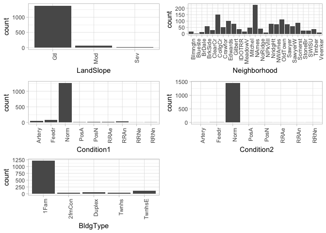

``` r
doPlots(train_cat, fun = plotHist, ii = 13:18, ncol = 2)
```

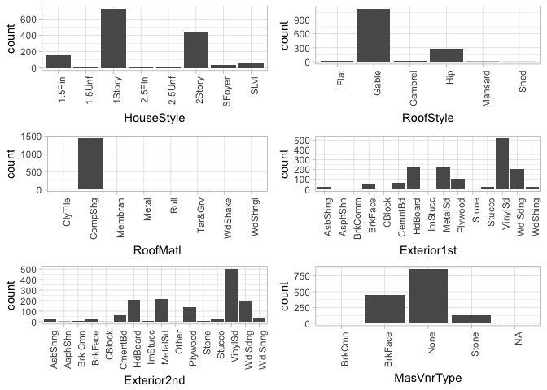

``` r
doPlots(train_cat, fun = plotHist, ii = 18:22, ncol = 2)
```

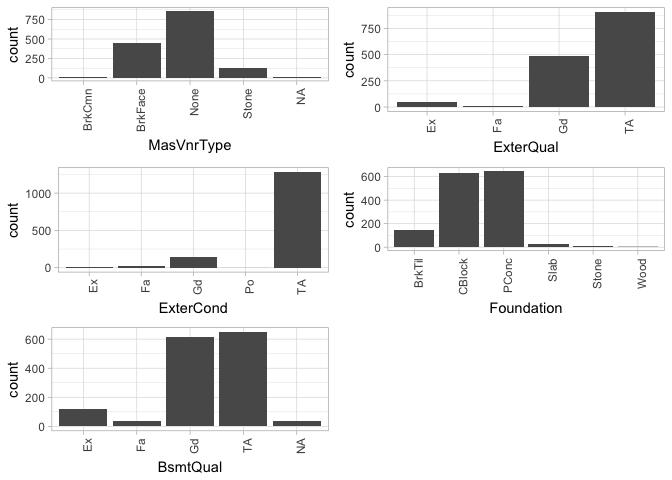

The barchart shows that most houses have moderate slopes and Crawford and Clear Creek Neighborhoods have highe slopes.

``` r
train %>% 
  filter(LandSlope == c('Sev', 'Mod')) %>% 
  group_by(Neighborhood, LandSlope) %>% 
  summarize(Count = n()) %>% 
  ggplot(aes(Neighborhood, Count)) + geom_bar(aes(fill = LandSlope), position = 'dodge', stat = 'identity') + 
  theme_light() +theme(axis.text.x = element_text(angle = 90, hjust =1))
```

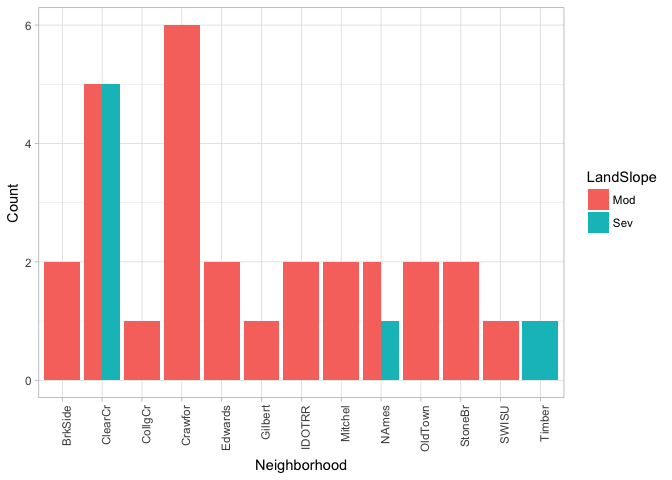

The barpolt between `Neighborhoods` and `SalePrice` indicates that most expensice houses are located in Northridge and Northridge Heights, while Briardale and Meadow Village have cheap houses.

``` r
  ggplot(data = train, aes(x=Neighborhood, y=SalePrice)) +
  geom_boxplot() + theme(axis.text.x = element_text(angle = 90, hjust = 1))+ xlab("Neighborhood")
```

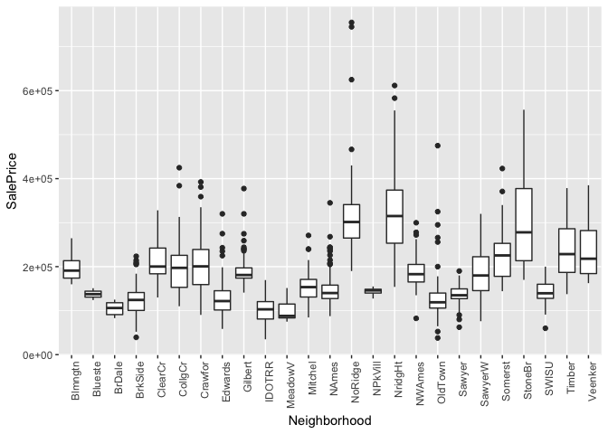

#### Correlation

``` r
#creat a correlation maxtrix
cormat <- cor(data.matrix(na.omit(train_cont[, -1])))
#correlation plot

row_indic <- apply(cormat, 1, function(x) sum(x > 0.3 | x < -0.3) > 1)
cormat<- cormat[row_indic ,row_indic ]

corrplot(cormat, method = "square")
```

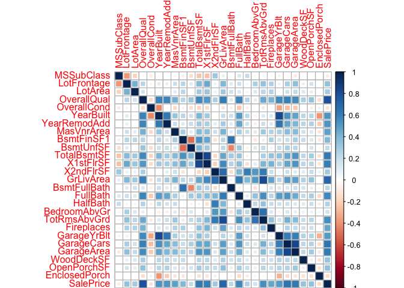

------------------------------------------------------------------------

Part 3: Modeling
----------------

#### Response variable

Summary statistics for target variable.

``` r
summary(train$SalePrice)
```

    ##    Min. 1st Qu.  Median    Mean 3rd Qu.    Max. 
    ##   34900  129975  163000  180921  214000  755000

As the response variable is right skewed, we can take the log of the variable to normalize it.

``` r
ggplot(data = train, aes(x=SalePrice)) +geom_histogram(col = 'white')+scale_x_continuous(labels = scales::comma)+theme_light()
```

    ## `stat_bin()` using `bins = 30`. Pick better value with `binwidth`.

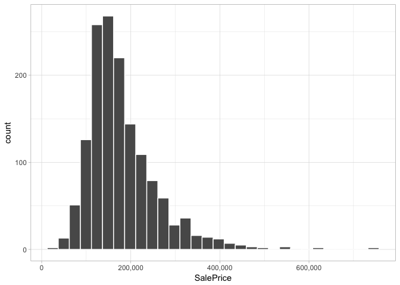

``` r
#Normalize distrubution
ggplot(train, aes(x=log(SalePrice+1))) + geom_histogram(col = 'white') + theme_light()
```

    ## `stat_bin()` using `bins = 30`. Pick better value with `binwidth`.

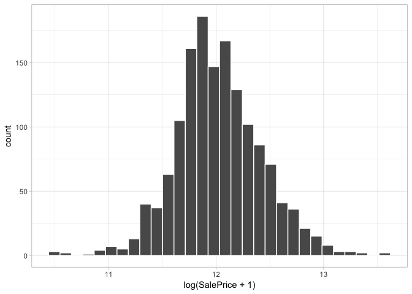

#### Data Processing

##### Impute Missing Data

The data description shows that variables with `NA` do not always mean the values are missing. For example, Eg: Fence NA means no Fence. We might also want to input the mean of that feature for some missing value in numerical data.

``` r
#exclud `id`
combined <- train[, 2:81]

#imputation for any missing values in numeric variables (mean)
all_numeric <- names(combined)[which(sapply(combined, is.numeric))]

for (x in all_numeric) {
    mean_value <- mean(train[[x]], na.rm = TRUE)
    combined[[x]][is.na(combined[[x]])] <- mean_value
}

#combined$MasVnrArea[which(is.na(combined$MasVnrArea))] <- #mean(combined$MasVnrArea, na.rm=T)

#impute NA to None

# Changing NA in Alley to None
combined$Alley1 <- as.character(combined$Alley)
combined$Alley1[which(is.na(combined$Alley))] <- "None"
combined$Alley <- as.factor(combined$Alley1)
combined <- subset(combined,select = -Alley1)
table(combined$Alley)
```

    ## 
    ## Grvl None Pave 
    ##   50 1369   41

``` r
# Changing NA in MasVnrType to None
combined$MasVnrType1 <- as.character(combined$MasVnrType)
combined$MasVnrType1[which(is.na(combined$MasVnrType))] <- "None"
combined$MasVnrType <- as.factor(combined$MasVnrType1)
combined <- subset(combined,select = -MasVnrType1)
table(combined$MasVnrType)
```

    ## 
    ##  BrkCmn BrkFace    None   Stone 
    ##      15     445     872     128

``` r
# Changing NA in FireplaceQu to None
combined$FireplaceQu1 <- as.character(combined$FireplaceQu)
combined$FireplaceQu1[which(is.na(combined$FireplaceQu))] <- "None"
combined$FireplaceQu <- as.factor(combined$FireplaceQu1)
combined <- subset(combined,select = -FireplaceQu1)

# Changing NA in PoolQC to None
combined$PoolQC1 <- as.character(combined$PoolQC)
combined$PoolQC1[which(is.na(combined$PoolQC))] <- "None"
combined$PoolQC <- as.factor(combined$PoolQC1)
combined <- subset(combined,select = -PoolQC1)

# Changing NA in Fence to None
combined$Fence1 <- as.character(combined$Fence)
combined$Fence1[which(is.na(combined$Fence))] <- "None"
combined$Fence <- as.factor(combined$Fence1)
combined <- subset(combined,select = -Fence1)

# Changing NA in MiscFeature to None
combined$MiscFeature1 <- as.character(combined$MiscFeature)
combined$MiscFeature1[which(is.na(combined$MiscFeature))] <- "None"
combined$MiscFeature <- as.factor(combined$MiscFeature1)
combined <- subset(combined,select = -MiscFeature1)

# Changing NA in GarageType to None
combined$GarageType1 <- as.character(combined$GarageType)
combined$GarageType1[which(is.na(combined$GarageType))] <- "None"
combined$GarageType <- as.factor(combined$GarageType1)
combined <- subset(combined,select = -GarageType1)

# Changing NA in GarageYrBlt to None
combined$GarageYrBlt[which(is.na(combined$GarageYrBlt))] <- 0 

# Changing NA in GarageFinish to None
combined$GarageFinish1 <- as.character(combined$GarageFinish)
combined$GarageFinish1[which(is.na(combined$GarageFinish))] <- "None"
combined$GarageFinish <- as.factor(combined$GarageFinish1)
combined <- subset(combined,select = -GarageFinish1)

# Changing NA in GarageQual to None
combined$GarageQual1 <- as.character(combined$GarageQual)
combined$GarageQual1[which(is.na(combined$GarageQual))] <- "None"
combined$GarageQual <- as.factor(combined$GarageQual1)
combined <- subset(combined,select = -GarageQual1)

# Changing NA in GarageCond to None
combined$GarageCond1 <- as.character(combined$GarageCond)
combined$GarageCond1[which(is.na(combined$GarageCond))] <- "None"
combined$GarageCond <- as.factor(combined$GarageCond1)
combined <- subset(combined,select = -GarageCond1)

# Changing NA in BsmtQual to None
combined$BsmtQual1 <- as.character(combined$BsmtQual)
combined$BsmtQual1[which(is.na(combined$BsmtQual))] <- "None"
combined$BsmtQual <- as.factor(combined$BsmtQual1)
combined <- subset(combined,select = -BsmtQual1)

# Changing NA in BsmtCond to None
combined$BsmtCond1 <- as.character(combined$BsmtCond)
combined$BsmtCond1[which(is.na(combined$BsmtCond))] <- "None"
combined$BsmtCond <- as.factor(combined$BsmtCond1)
combined <- subset(combined,select = -BsmtCond1)

# Changing NA in BsmtExposure to None
combined$BsmtExposure1 <- as.character(combined$BsmtExposure)
combined$BsmtExposure1[which(is.na(combined$BsmtExposure))] <- "None"
combined$BsmtExposure <- as.factor(combined$BsmtExposure1)
combined <- subset(combined,select = -BsmtExposure1)

# Changing NA in BsmtFinType1 to None
combined$BsmtFinType11 <- as.character(combined$BsmtFinType1)
combined$BsmtFinType11[which(is.na(combined$BsmtFinType1))] <- "None"
combined$BsmtFinType1 <- as.factor(combined$BsmtFinType11)
combined <- subset(combined,select = -BsmtFinType11)
# Changing NA in BsmtFinType2 to None
combined$BsmtFinType21 <- as.character(combined$BsmtFinType2)
combined$BsmtFinType21[which(is.na(combined$BsmtFinType2))] <- "None"
combined$BsmtFinType2 <- as.factor(combined$BsmtFinType21)
combined <- subset(combined,select = -BsmtFinType21)

# Changing NA in Electrical to None
combined$Electrical1 <- as.character(combined$Electrical)
combined$Electrical1[which(is.na(combined$Electrical))] <- "None"
combined$Electrical <- as.factor(combined$Electrical1)
combined <- subset(combined,select = -Electrical1)
```

``` r
#Log transformation for numeric feature with excessive skewness

#transform SalePrice to log form
#train$lSalePrice <- log(train$SalePrice +1)

#perform log transformation for those numeric feature with excessive skewness
all_numeric <- names(combined)[which(sapply(combined, is.numeric))]

all_numeric <- all_numeric[1:length(all_numeric)-1]

#determine skew for each numeric feature
skewed_feats <- sapply(all_numeric, function(x){skewness(combined[[x]], na.rm = T)})

# keep only features that exceed a threshold for skewness
skewed_feats <- skewed_feats[skewed_feats > 0.75]

#take log for variables in `skewed_feats`
for(x in names(skewed_feats)){
  combined[[x]] <- log(combined[[x]]+1)
}
```

### Convert character to factors

``` r
setDT(combined)
combined[,(cat_var) := lapply(.SD, as.factor), .SDcols = cat_var]

#train[, lapply(.SD, as.factor), .SDcols = cat_var]
#sapply(train[, .SD, .SDcols = cat_var], as.factor)
```

### Split data

``` r
set.seed(10000)
smp <- sample(c(1:dim(combined)[1]), dim(combined)[1]*0.75)

#smp_size  <- floor(0.75*nrow(combined))
#sample <- sample.int(n=nrow(combined), size=smp_size, replace = F)

train2 = combined[smp,]
test_valid <- combined[-smp,]

lSalePrice <- log(train2$SalePrice+1)
lSalePrice_test <- log(test_valid$SalePrice+1)
```

#### 3.1 Lasso

Lasso (least absolute shrinkage and selection operator) is a regression analysis method that performs both variable selection and regularization in order to enhance the prediction accuracy and interpretability of the statistical model it produces.

Setting λ=0 yields the familiar minimization of squared residuals while for greater values, some of the coefficients will be set to zero. As λ→∞, all the coefficents will be set to zero. λ that controls the amount of regularization.

Crossvalidation is a predictive criterion that evaluates the sample performance by splitting the sample into training and validation sets and choosing the value of lambda with which the error of prediction is minimal.

``` r
#Transform all explantory variables to matrix form
str(train2)
```

    ## Classes 'data.table' and 'data.frame':   1095 obs. of  80 variables:
    ##  $ MSSubClass   : Factor w/ 15 levels "3.04452243772342",..: 1 6 1 6 12 12 1 5 5 6 ...
    ##  $ MSZoning     : Factor w/ 5 levels "C (all)","FV",..: 4 4 4 2 5 5 4 4 4 4 ...
    ##  $ LotFrontage  : num  4.26 4.65 4.39 4.33 4.26 ...
    ##  $ LotArea      : num  9.26 9.98 9.17 9.11 8.4 ...
    ##  $ Street       : Factor w/ 2 levels "Grvl","Pave": 2 2 2 2 2 2 2 2 2 2 ...
    ##  $ Alley        : Factor w/ 3 levels "Grvl","None",..: 2 2 2 2 2 2 2 2 2 2 ...
    ##  $ LotShape     : Factor w/ 4 levels "IR1","IR2","IR3",..: 1 1 4 4 4 4 1 4 1 4 ...
    ##  $ LandContour  : Factor w/ 4 levels "Bnk","HLS","Low",..: 4 4 4 4 4 4 4 4 4 4 ...
    ##  $ Utilities    : Factor w/ 2 levels "AllPub","NoSeWa": 1 1 1 1 1 1 1 1 1 1 ...
    ##  $ LotConfig    : Factor w/ 5 levels "Corner","CulDSac",..: 1 1 5 5 5 3 5 5 5 1 ...
    ##  $ LandSlope    : Factor w/ 3 levels "Gtl","Mod","Sev": 1 1 1 1 1 1 1 1 1 1 ...
    ##  $ Neighborhood : Factor w/ 25 levels "Blmngtn","Blueste",..: 13 14 13 21 6 12 6 13 12 13 ...
    ##  $ Condition1   : Factor w/ 9 levels "Artery","Feedr",..: 3 3 3 3 3 3 3 3 3 3 ...
    ##  $ Condition2   : Factor w/ 8 levels "Artery","Feedr",..: 3 3 3 3 3 3 3 3 3 3 ...
    ##  $ BldgType     : Factor w/ 5 levels "1Fam","2fmCon",..: 1 1 1 1 5 4 1 1 1 1 ...
    ##  $ HouseStyle   : Factor w/ 8 levels "1.5Fin","1.5Unf",..: 3 6 3 6 3 3 3 1 1 6 ...
    ##  $ OverallQual  : num  6 10 5 8 6 6 6 6 6 6 ...
    ##  $ OverallCond  : num  5 6 7 5 5 5 5 5 7 6 ...
    ##  $ YearBuilt    : num  1971 1994 1950 2007 2003 ...
    ##  $ YearRemodAdd : num  1971 1995 2007 2007 2003 ...
    ##  $ RoofStyle    : Factor w/ 6 levels "Flat","Gable",..: 4 2 2 2 2 4 2 2 2 2 ...
    ##  $ RoofMatl     : Factor w/ 8 levels "ClyTile","CompShg",..: 2 8 2 2 2 2 2 2 2 2 ...
    ##  $ Exterior1st  : Factor w/ 15 levels "AsbShng","AsphShn",..: 10 7 9 6 13 13 13 13 13 13 ...
    ##  $ Exterior2nd  : Factor w/ 16 levels "AsbShng","AsphShn",..: 11 7 9 6 14 14 14 14 14 14 ...
    ##  $ MasVnrType   : Factor w/ 4 levels "BrkCmn","BrkFace",..: 3 2 3 3 2 2 3 3 3 2 ...
    ##  $ MasVnrArea   : num  0 7.07 0 0 5.14 ...
    ##  $ ExterQual    : Factor w/ 4 levels "Ex","Fa","Gd",..: 4 1 3 3 3 4 3 4 4 4 ...
    ##  $ ExterCond    : Factor w/ 5 levels "Ex","Fa","Gd",..: 5 5 5 5 5 5 5 5 5 3 ...
    ##  $ Foundation   : Factor w/ 6 levels "BrkTil","CBlock",..: 2 3 2 3 3 3 3 2 2 2 ...
    ##  $ BsmtQual     : Factor w/ 5 levels "Ex","Fa","Gd",..: 5 1 5 3 3 1 3 5 3 3 ...
    ##  $ BsmtCond     : Factor w/ 5 levels "Fa","Gd","None",..: 5 5 5 5 5 5 5 5 5 5 ...
    ##  $ BsmtExposure : Factor w/ 5 levels "Av","Gd","Mn",..: 4 2 4 1 1 4 4 4 3 4 ...
    ##  $ BsmtFinType1 : Factor w/ 7 levels "ALQ","BLQ","GLQ",..: 1 3 1 3 3 3 3 2 1 6 ...
    ##  $ BsmtFinSF1   : num  5.65 7.28 6.41 4.17 6.53 ...
    ##  $ BsmtFinType2 : Factor w/ 7 levels "ALQ","BLQ","GLQ",..: 4 7 7 7 7 7 7 7 7 7 ...
    ##  $ BsmtFinSF2   : num  3.58 0 0 0 0 ...
    ##  $ BsmtUnfSF    : num  6.5 6.9 6.23 7.02 5.1 ...
    ##  $ TotalBsmtSF  : num  6.89 7.8 7.02 7.08 6.74 ...
    ##  $ Heating      : Factor w/ 6 levels "Floor","GasA",..: 2 2 2 2 2 2 2 2 2 2 ...
    ##  $ HeatingQC    : Factor w/ 5 levels "Ex","Fa","Gd",..: 5 1 3 1 1 1 3 5 1 5 ...
    ##  $ CentralAir   : Factor w/ 2 levels "N","Y": 2 2 2 2 2 2 2 2 2 2 ...
    ##  $ Electrical   : Factor w/ 6 levels "FuseA","FuseF",..: 6 6 6 6 6 6 6 1 6 6 ...
    ##  $ X1stFlrSF    : num  6.89 7.8 7.02 7.08 6.74 ...
    ##  $ X2ndFlrSF    : num  0 7.54 0 7.26 0 ...
    ##  $ LowQualFinSF : num  0 0 0 0 0 0 0 0 0 0 ...
    ##  $ GrLivArea    : num  6.89 8.37 7.02 7.87 6.74 ...
    ##  $ BsmtFullBath : Factor w/ 4 levels "0","1","2","3": 2 1 1 1 2 2 1 1 2 1 ...
    ##  $ BsmtHalfBath : Factor w/ 3 levels "0","0.693147180559945",..: 1 2 1 1 1 1 1 1 1 1 ...
    ##  $ FullBath     : num  1 3 1 2 1 2 2 1 2 2 ...
    ##  $ HalfBath     : Factor w/ 3 levels "0","1","2": 2 2 1 2 1 1 1 1 1 2 ...
    ##  $ BedroomAbvGr : Factor w/ 8 levels "0","1","2","3",..: 4 5 4 5 2 3 4 4 5 5 ...
    ##  $ KitchenAbvGr : Factor w/ 4 levels "0","0.693147180559945",..: 2 2 2 2 2 2 2 2 2 2 ...
    ##  $ KitchenQual  : Factor w/ 4 levels "Ex","Fa","Gd",..: 4 1 3 1 3 4 3 4 4 3 ...
    ##  $ TotRmsAbvGrd : num  5 10 5 11 4 5 6 6 7 8 ...
    ##  $ Functional   : Factor w/ 7 levels "Maj1","Maj2",..: 7 7 7 7 7 7 7 7 5 7 ...
    ##  $ Fireplaces   : num  0 2 1 1 0 0 1 0 0 1 ...
    ##  $ FireplaceQu  : Factor w/ 6 levels "Ex","Fa","Gd",..: 4 1 3 3 4 4 3 4 4 3 ...
    ##  $ GarageType   : Factor w/ 7 levels "2Types","Attchd",..: 6 2 2 4 2 2 2 2 2 2 ...
    ##  $ GarageYrBlt  : num  1979 1994 1950 2007 2003 ...
    ##  $ GarageFinish : Factor w/ 4 levels "Fin","None","RFn",..: 4 1 4 1 1 4 3 4 4 1 ...
    ##  $ GarageCars   : num  2 3 1 2 2 2 2 1 1 1 ...
    ##  $ GarageArea   : num  576 832 264 550 420 402 440 288 423 509 ...
    ##  $ GarageQual   : Factor w/ 6 levels "Ex","Fa","Gd",..: 6 6 6 6 6 6 6 6 6 6 ...
    ##  $ GarageCond   : Factor w/ 6 levels "Ex","Fa","Gd",..: 6 6 6 6 6 6 6 6 6 6 ...
    ##  $ PavedDrive   : Factor w/ 3 levels "N","P","Y": 3 3 3 3 3 3 3 3 3 3 ...
    ##  $ WoodDeckSF   : num  0 5.95 0 5.34 4.95 ...
    ##  $ OpenPorchSF  : num  5.75 3.93 4.39 5.9 0 ...
    ##  $ EnclosedPorch: num  3.71 0 4.8 0 0 ...
    ##  $ X3SsnPorch   : num  0 0 0 0 0 0 0 0 0 0 ...
    ##  $ ScreenPorch  : num  0 0 0 0 0 ...
    ##  $ PoolArea     : num  0 0 0 0 0 0 0 0 0 0 ...
    ##  $ PoolQC       : Factor w/ 4 levels "Ex","Fa","Gd",..: 4 4 4 4 4 4 4 4 4 4 ...
    ##  $ Fence        : Factor w/ 5 levels "GdPrv","GdWo",..: 5 5 5 5 5 5 5 5 5 5 ...
    ##  $ MiscFeature  : Factor w/ 5 levels "Gar2","None",..: 2 2 2 2 2 2 2 2 4 2 ...
    ##  $ MiscVal      : num  0 0 0 0 0 ...
    ##  $ MoSold       : num  3 1 7 8 5 5 3 4 7 6 ...
    ##  $ YrSold       : num  2007 2007 2009 2007 2009 ...
    ##  $ SaleType     : Factor w/ 9 levels "COD","Con","ConLD",..: 9 9 9 7 9 9 9 9 9 9 ...
    ##  $ SaleCondition: Factor w/ 6 levels "Abnorml","AdjLand",..: 5 5 5 6 5 5 5 1 5 5 ...
    ##  $ SalePrice    : num  143250 755000 147000 303477 140000 ...
    ##  - attr(*, ".internal.selfref")=<externalptr>

``` r
x = model.matrix(lSalePrice~.-SalePrice,data = train2)

y= lSalePrice

####
#set lambda
grid=seq(1,0,-0.001)

lasso.model = glmnet(x,y=y, lambda = grid, alpha = 1)
dim(coef(lasso.model))
```

    ## [1]  287 1001

``` r
#cross-validation
cv = cv.glmnet(x,y,alpha=1)
plot(cv)
```

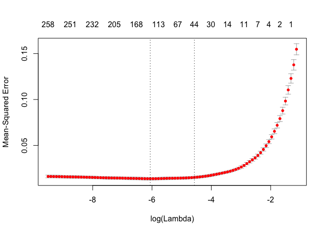

``` r
names(cv)
```

    ##  [1] "lambda"     "cvm"        "cvsd"       "cvup"       "cvlo"      
    ##  [6] "nzero"      "name"       "glmnet.fit" "lambda.min" "lambda.1se"

``` r
bestlam = cv$lambda.min
mse.min <- cv$cvm[cv$lambda==cv$lambda.min]

Model_lasso = glmnet(x,y,alpha = 1, lambda = bestlam)

coef(Model_lasso)
```

    ## 287 x 1 sparse Matrix of class "dgCMatrix"
    ##                                          s0
    ## (Intercept)                    2.176399e+00
    ## (Intercept)                    .           
    ## MSSubClass3.43398720448515    -5.290884e-02
    ## MSSubClass3.71357206670431    -6.701340e-03
    ## MSSubClass3.8286413964891      .           
    ## MSSubClass3.93182563272433    -1.899523e-02
    ## MSSubClass4.11087386417331     .           
    ## MSSubClass4.26267987704132     4.946626e-03
    ## MSSubClass4.33073334028633     .           
    ## MSSubClass4.39444915467244     .           
    ## MSSubClass4.45434729625351     .           
    ## MSSubClass4.51085950651685     .           
    ## MSSubClass4.79579054559674     .           
    ## MSSubClass5.08140436498446    -3.288291e-02
    ## MSSubClass5.19849703126583     .           
    ## MSSubClass5.25227342804663     .           
    ## MSZoningFV                     7.727224e-03
    ## MSZoningRH                     1.142937e-02
    ## MSZoningRL                     1.879345e-02
    ## MSZoningRM                     .           
    ## LotFrontage                    2.176580e-02
    ## LotArea                        6.322431e-02
    ## StreetPave                     7.245339e-03
    ## AlleyNone                      .           
    ## AlleyPave                      2.656831e-02
    ## LotShapeIR2                    1.225947e-02
    ## LotShapeIR3                    6.663488e-03
    ## LotShapeReg                    .           
    ## LandContourHLS                 .           
    ## LandContourLow                 .           
    ## LandContourLvl                 .           
    ## UtilitiesNoSeWa               -1.160853e-01
    ## LotConfigCulDSac               3.448724e-02
    ## LotConfigFR2                  -2.086290e-03
    ## LotConfigFR3                  -3.943465e-02
    ## LotConfigInside                .           
    ## LandSlopeMod                   .           
    ## LandSlopeSev                  -6.893800e-02
    ## NeighborhoodBlueste            .           
    ## NeighborhoodBrDale             .           
    ## NeighborhoodBrkSide            2.478675e-02
    ## NeighborhoodClearCr            2.840311e-02
    ## NeighborhoodCollgCr            .           
    ## NeighborhoodCrawfor            8.533663e-02
    ## NeighborhoodEdwards           -3.767848e-02
    ## NeighborhoodGilbert            .           
    ## NeighborhoodIDOTRR            -7.820373e-02
    ## NeighborhoodMeadowV           -2.015274e-02
    ## NeighborhoodMitchel           -3.318073e-02
    ## NeighborhoodNAmes             -1.889009e-02
    ## NeighborhoodNoRidge            9.497491e-02
    ## NeighborhoodNPkVill            .           
    ## NeighborhoodNridgHt            7.603027e-02
    ## NeighborhoodNWAmes            -1.171202e-02
    ## NeighborhoodOldTown           -3.052089e-02
    ## NeighborhoodSawyer             .           
    ## NeighborhoodSawyerW            .           
    ## NeighborhoodSomerst            6.041237e-02
    ## NeighborhoodStoneBr            1.160545e-01
    ## NeighborhoodSWISU              .           
    ## NeighborhoodTimber             .           
    ## NeighborhoodVeenker            .           
    ## Condition1Feedr                .           
    ## Condition1Norm                 4.354888e-02
    ## Condition1PosA                 .           
    ## Condition1PosN                 2.271368e-03
    ## Condition1RRAe                -6.265703e-02
    ## Condition1RRAn                 .           
    ## Condition1RRNe                 .           
    ## Condition1RRNn                 8.767336e-04
    ## Condition2Feedr               -6.007438e-02
    ## Condition2Norm                 .           
    ## Condition2PosA                 7.519078e-02
    ## Condition2PosN                -5.473148e-01
    ## Condition2RRAe                 .           
    ## Condition2RRAn                 .           
    ## Condition2RRNn                 .           
    ## BldgType2fmCon                 .           
    ## BldgTypeDuplex                 .           
    ## BldgTypeTwnhs                 -6.633113e-03
    ## BldgTypeTwnhsE                 .           
    ## HouseStyle1.5Unf               6.796377e-03
    ## HouseStyle1Story               .           
    ## HouseStyle2.5Fin               .           
    ## HouseStyle2.5Unf               .           
    ## HouseStyle2Story               .           
    ## HouseStyleSFoyer               .           
    ## HouseStyleSLvl                -1.791807e-02
    ## OverallQual                    5.690363e-02
    ## OverallCond                    3.631887e-02
    ## YearBuilt                      1.638289e-03
    ## YearRemodAdd                   8.445642e-04
    ## RoofStyleGable                -4.165418e-03
    ## RoofStyleGambrel               1.245081e-02
    ## RoofStyleHip                   .           
    ## RoofStyleMansard               .           
    ## RoofStyleShed                  .           
    ## RoofMatlCompShg               -5.625871e-04
    ## RoofMatlMembran                .           
    ## RoofMatlMetal                  3.813065e-02
    ## RoofMatlRoll                   .           
    ## RoofMatlTar&Grv                .           
    ## RoofMatlWdShake                .           
    ## RoofMatlWdShngl                1.336286e-01
    ## Exterior1stAsphShn             .           
    ## Exterior1stBrkComm            -2.136845e-01
    ## Exterior1stBrkFace             7.772764e-02
    ## Exterior1stCBlock              .           
    ## Exterior1stCemntBd             .           
    ## Exterior1stHdBoard            -5.002673e-03
    ## Exterior1stImStucc             .           
    ## Exterior1stMetalSd             5.892617e-03
    ## Exterior1stPlywood             .           
    ## Exterior1stStone               .           
    ## Exterior1stStucco              .           
    ## Exterior1stVinylSd             1.276457e-03
    ## Exterior1stWd Sdng            -3.466402e-03
    ## Exterior1stWdShing             .           
    ## Exterior2ndAsphShn             .           
    ## Exterior2ndBrk Cmn             .           
    ## Exterior2ndBrkFace             .           
    ## Exterior2ndCBlock              .           
    ## Exterior2ndCmentBd             .           
    ## Exterior2ndHdBoard             .           
    ## Exterior2ndImStucc             3.494737e-03
    ## Exterior2ndMetalSd             .           
    ## Exterior2ndOther               .           
    ## Exterior2ndPlywood             .           
    ## Exterior2ndStone               .           
    ## Exterior2ndStucco              .           
    ## Exterior2ndVinylSd             .           
    ## Exterior2ndWd Sdng             .           
    ## Exterior2ndWd Shng             .           
    ## MasVnrTypeBrkFace              .           
    ## MasVnrTypeNone                 .           
    ## MasVnrTypeStone                2.138882e-03
    ## MasVnrArea                     .           
    ## ExterQualFa                    .           
    ## ExterQualGd                    .           
    ## ExterQualTA                   -4.987811e-03
    ## ExterCondFa                   -1.892296e-02
    ## ExterCondGd                    .           
    ## ExterCondPo                    .           
    ## ExterCondTA                    .           
    ## FoundationCBlock              -1.790734e-02
    ## FoundationPConc                5.398684e-03
    ## FoundationSlab                 .           
    ## FoundationStone                .           
    ## FoundationWood                 .           
    ## BsmtQualFa                    -2.390919e-02
    ## BsmtQualGd                    -3.247988e-02
    ## BsmtQualNone                   .           
    ## BsmtQualTA                    -2.722789e-02
    ## BsmtCondGd                     .           
    ## BsmtCondNone                   .           
    ## BsmtCondPo                     .           
    ## BsmtCondTA                     .           
    ## BsmtExposureGd                 3.972691e-02
    ## BsmtExposureMn                 .           
    ## BsmtExposureNo                -1.099556e-02
    ## BsmtExposureNone               .           
    ## BsmtFinType1BLQ                .           
    ## BsmtFinType1GLQ                .           
    ## BsmtFinType1LwQ               -2.910171e-03
    ## BsmtFinType1None               .           
    ## BsmtFinType1Rec               -6.291802e-03
    ## BsmtFinType1Unf                .           
    ## BsmtFinSF1                     9.196573e-03
    ## BsmtFinType2BLQ                .           
    ## BsmtFinType2GLQ                .           
    ## BsmtFinType2LwQ                .           
    ## BsmtFinType2None               .           
    ## BsmtFinType2Rec               -2.565035e-03
    ## BsmtFinType2Unf                .           
    ## BsmtFinSF2                     .           
    ## BsmtUnfSF                     -5.602526e-04
    ## TotalBsmtSF                    2.001941e-02
    ## HeatingGasA                    .           
    ## HeatingGasW                    7.314536e-02
    ## HeatingGrav                   -3.740556e-02
    ## HeatingOthW                   -5.759722e-02
    ## HeatingWall                    .           
    ## HeatingQCFa                   -1.881112e-02
    ## HeatingQCGd                   -3.891792e-03
    ## HeatingQCPo                    .           
    ## HeatingQCTA                   -2.502924e-02
    ## CentralAirY                    5.459042e-02
    ## ElectricalFuseF                2.048744e-02
    ## ElectricalFuseP                .           
    ## ElectricalMix                  .           
    ## ElectricalNone                 3.797815e-02
    ## ElectricalSBrkr                .           
    ## X1stFlrSF                      9.253773e-02
    ## X2ndFlrSF                      .           
    ## LowQualFinSF                  -6.997255e-03
    ## GrLivArea                      3.462781e-01
    ## BsmtFullBath1                  2.901560e-02
    ## BsmtFullBath2                  4.756148e-02
    ## BsmtFullBath3                  1.963809e-01
    ## BsmtHalfBath0.693147180559945  .           
    ## BsmtHalfBath1.09861228866811   .           
    ## FullBath                       2.453784e-02
    ## HalfBath1                      9.387958e-03
    ## HalfBath2                      .           
    ## BedroomAbvGr1                  .           
    ## BedroomAbvGr2                  7.183693e-03
    ## BedroomAbvGr3                 -3.588572e-03
    ## BedroomAbvGr4                  .           
    ## BedroomAbvGr5                 -1.221265e-02
    ## BedroomAbvGr6                  .           
    ## BedroomAbvGr8                  3.892305e-02
    ## KitchenAbvGr0.693147180559945  7.092575e-02
    ## KitchenAbvGr1.09861228866811  -1.364630e-02
    ## KitchenAbvGr1.38629436111989  -4.894039e-02
    ## KitchenQualFa                  .           
    ## KitchenQualGd                 -2.759379e-02
    ## KitchenQualTA                 -2.914761e-02
    ## TotRmsAbvGrd                   3.230175e-03
    ## FunctionalMaj2                -1.347597e-01
    ## FunctionalMin1                 .           
    ## FunctionalMin2                 .           
    ## FunctionalMod                  .           
    ## FunctionalSev                  .           
    ## FunctionalTyp                  5.634523e-02
    ## Fireplaces                     2.200753e-02
    ## FireplaceQuFa                 -5.665729e-03
    ## FireplaceQuGd                  7.065173e-03
    ## FireplaceQuNone                .           
    ## FireplaceQuPo                  1.729185e-02
    ## FireplaceQuTA                  .           
    ## GarageTypeAttchd               .           
    ## GarageTypeBasment              .           
    ## GarageTypeBuiltIn              7.327777e-04
    ## GarageTypeCarPort              .           
    ## GarageTypeDetchd               .           
    ## GarageTypeNone                 .           
    ## GarageYrBlt                    .           
    ## GarageFinishNone               .           
    ## GarageFinishRFn                .           
    ## GarageFinishUnf                .           
    ## GarageCars                     2.657446e-02
    ## GarageArea                     9.951208e-05
    ## GarageQualFa                  -1.826366e-02
    ## GarageQualGd                   .           
    ## GarageQualNone                 .           
    ## GarageQualPo                   .           
    ## GarageQualTA                   .           
    ## GarageCondFa                   .           
    ## GarageCondGd                   .           
    ## GarageCondNone                 .           
    ## GarageCondPo                   .           
    ## GarageCondTA                   .           
    ## PavedDriveP                    .           
    ## PavedDriveY                    1.257331e-02
    ## WoodDeckSF                     2.824703e-03
    ## OpenPorchSF                    1.370412e-03
    ## EnclosedPorch                  .           
    ## X3SsnPorch                     .           
    ## ScreenPorch                    6.271936e-03
    ## PoolArea                       1.254660e-02
    ## PoolQCFa                      -7.149262e-03
    ## PoolQCGd                       9.352916e-02
    ## PoolQCNone                     .           
    ## FenceGdWo                     -3.431905e-03
    ## FenceMnPrv                     .           
    ## FenceMnWw                      .           
    ## FenceNone                      .           
    ## MiscFeatureNone                .           
    ## MiscFeatureOthr                .           
    ## MiscFeatureShed                .           
    ## MiscFeatureTenC               -9.379500e-03
    ## MiscVal                        .           
    ## MoSold                        -7.517081e-04
    ## YrSold                         .           
    ## SaleTypeCon                    4.067740e-02
    ## SaleTypeConLD                  1.847395e-02
    ## SaleTypeConLI                  1.921772e-02
    ## SaleTypeConLw                  .           
    ## SaleTypeCWD                    4.322899e-02
    ## SaleTypeNew                    8.290760e-02
    ## SaleTypeOth                    1.476654e-01
    ## SaleTypeWD                     .           
    ## SaleConditionAdjLand           2.720786e-02
    ## SaleConditionAlloca            .           
    ## SaleConditionFamily            .           
    ## SaleConditionNormal            3.034399e-02
    ## SaleConditionPartial           .

#### 3.2 CART

``` r
lSalePrice <- log(train2$SalePrice)


class.tree <- rpart(lSalePrice~.-SalePrice,
                    data = train2, control = rpart.control(cp = 0.01))

plotcp(class.tree)
```

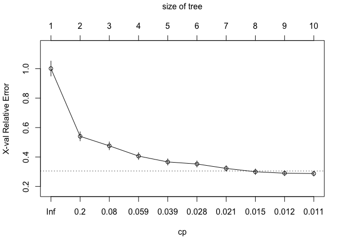

``` r
printcp(class.tree)
```

    ## 
    ## Regression tree:
    ## rpart(formula = lSalePrice ~ . - SalePrice, data = train2, control = rpart.control(cp = 0.01))
    ## 
    ## Variables actually used in tree construction:
    ## [1] CentralAir   Fireplaces   GrLivArea    Neighborhood OverallQual 
    ## [6] TotalBsmtSF 
    ## 
    ## Root node error: 169.65/1095 = 0.15493
    ## 
    ## n= 1095 
    ## 
    ##          CP nsplit rel error  xerror     xstd
    ## 1  0.462065      0   1.00000 1.00105 0.051246
    ## 2  0.088302      1   0.53793 0.54056 0.030948
    ## 3  0.071604      2   0.44963 0.47582 0.027109
    ## 4  0.048155      3   0.37803 0.40615 0.023805
    ## 5  0.031822      4   0.32987 0.36643 0.021555
    ## 6  0.024905      5   0.29805 0.35251 0.021201
    ## 7  0.017704      6   0.27315 0.32241 0.019573
    ## 8  0.012488      7   0.25544 0.29971 0.019515
    ## 9  0.011085      8   0.24295 0.28989 0.017737
    ## 10 0.010000      9   0.23187 0.28757 0.017466

``` r
rpart.plot(class.tree, 
           box.palette="GnBu",
           branch.lty=3, shadow.col="gray", nn=TRUE)
```

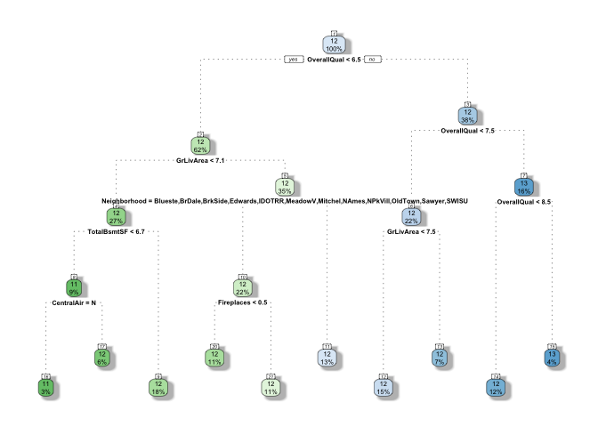

#### 3.3 Random Forest

``` r
RF <- randomForest(lSalePrice ~.-SalePrice, data = train2, 
                   method = "anova",
                   importance=TRUE,ntree=500,nodesize=7,
                   na.action=na.roughfix)
```

#### 3.4 Gradient Boosting

``` r
GB <- gbm(lSalePrice ~.-SalePrice, data = train2, distribution = "laplace",
              shrinkage = 0.05,
              interaction.depth = 5,
              bag.fraction = 0.66,
              n.minobsinnode = 1,
              cv.folds = 100,
              keep.data = F,
              verbose = F,
              n.trees = 300)
```

``` r
# variable importance
options(repr.plot.width=9, repr.plot.height=6)
varImpPlot(RF, type=1)
```

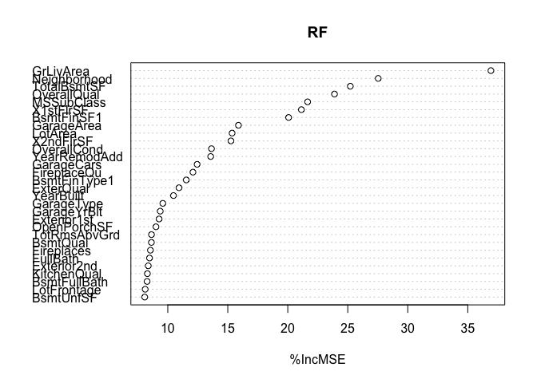

------------------------------------------------------------------------

Part 4:Prediction
-----------------

### 4.2 CART

``` r
cart.pred <- predict(class.tree, test_valid)

accuracy(cart.pred,lSalePrice_test )
```

    ##                   ME      RMSE       MAE        MPE     MAPE
    ## Test set -0.03044369 0.2281791 0.1660649 -0.2896684 1.394871

### 4.3 Ramdom Forest

``` r
rf.pred <- predict(RF, newdata = test_valid)

accuracy(rf.pred, lSalePrice_test)
```

    ##                   ME     RMSE       MAE        MPE      MAPE
    ## Test set -0.01785253 0.155144 0.1004345 -0.1761729 0.8457467

``` r
plot(rf.pred, lSalePrice_test, main = "Predicted vs. Actual log SalePrice") 
abline(0,1)
```

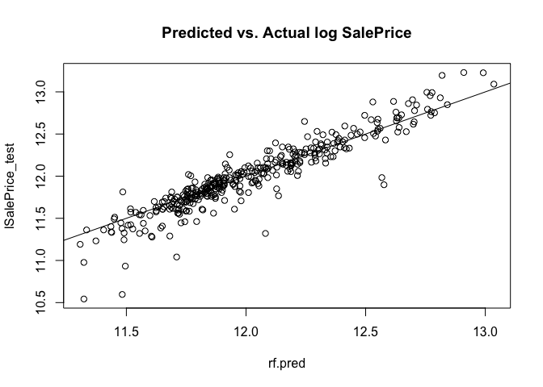

### 4.4 Gradient Boosting

``` r
gb.pred <- predict(GB, newdata=test_valid, n.trees = 300)

accuracy(gb.pred,lSalePrice_test)
```

    ##                   ME      RMSE        MAE        MPE      MAPE
    ## Test set -0.02458478 0.1507721 0.09395011 -0.2257509 0.7914697

------------------------------------------------------------------------
